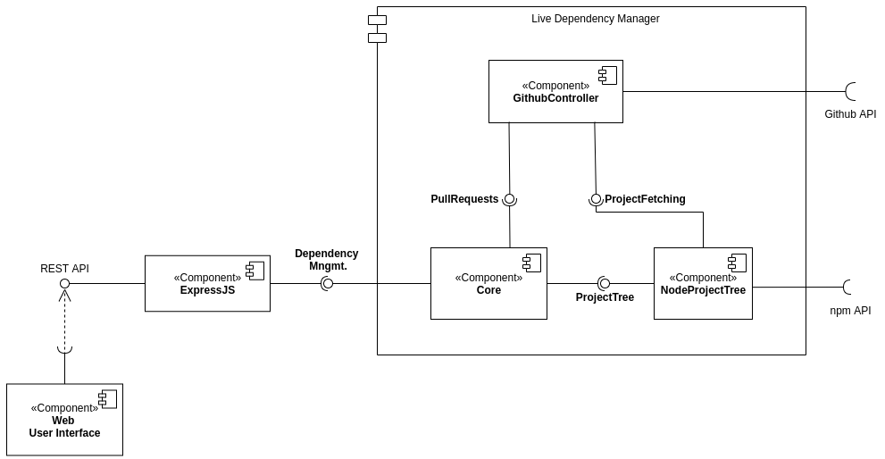
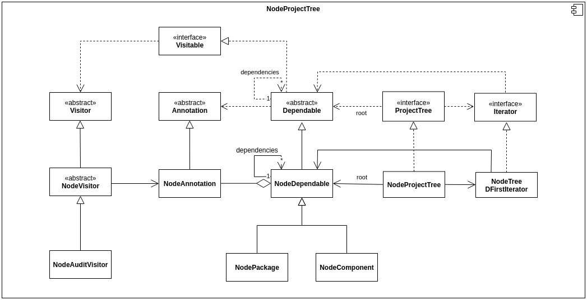

# Live Dependency Management

The aim of this project is to provide a way to explore and refactor the dependency graph of an application or library.

After being given the location (git repository) of a software project, it will produce a visualization of the dependency graph. Ideas for visualization could be using fractals to manage the number of nodes shown at any given time, visualizing the presence of updates, deprecations, and security advisories, and highlighting circular, parallel, or conflicting dependencies.

The live development aspect would be giving the user the option of altering or removing dependencies, showing in real-time the consequences of such actions. After committing to a set of changes, the component would make a commit, issue a patch or make a pull request to apply the intended changes.

This application can make use of the git crawling modules made by other groups. We will use team ST’s git crawlers to analyze the results of the applied dependencies refactoring. The underlying information used on our web-based visualization can integrate with AR/VR components to provide richer visualization capabilities.

---

# 👨‍👨‍👦‍👦 Group members:

- David Silva – [up201705373@fe.up.pt](mailto:up201705373@fe.up.pt)
- Gonçalo Marantes - [up201706917@fe.up.pt](mailto:up201706917@fe.up.pt)
- João N. Matos – up[201705471@fe.up.pt](mailto:201705471@fe.up.pt)
- Luís Cunha – [up201706736@fe.up.pt](mailto:up201706736@fe.up.pt)
- Ricardo Ferreira – [ee03195@fe.up.pt](mailto:ee200305418@fe.up.pt)

---

# 🏃 How to run this project

Since we are using docker to containerize our application we can simply run it using:

```bash
# development
docker-compose up --build
# production
docker-compose up --build -f docker-compose.production.yml
```

Don't forget to copy the `.env.example` to `.env` for development and `.env.production` for production. Then simply change the values to best fit your needs.

---

# 🖌️ Design decisions:

### #1 - What language to use?

- Choose a language that both suits a project and that is **compatible with the other projects**. Must be **appliable to different contexts** (to avoid the complexity of having several languages):
    - Dependency analysis module
    - Visualization module

**Decision:** Typescript.

### #2 - How do display the dependency graph?

- Choose a way of displaying the graph that is intuitive and still enables analysis on projects on a large scale.

**Decision:** Display using fractal graphs.

### #3 -  Best suited architecture?

- The overall application architecture must allow for the separation of concerns of different modules, creating a degree of modularity.

**Decision:** The LiveSD project is using a Layered approach.

### #4 - How to internally represent the dependency tree?

- The dependency is potentially a large structure with a lot of caveats that need to be managed.

**Decision:** *Discussed later*

### #5 - How to externally represent the dependency tree?

- The dependency tree needs to be represented in a format that can be used by external tools (JSON, XML, ...).

**Decision:** *Discussed later*

---

# ❌ Issues/Challenges:

- Integration with other groups’ modules (project crawler and AR/VR visualization). We need to choose the scope of our module in a way that both allows for integration with the overall system but also still lets us make a meaningful contribution to the overall project.
- Support for various package/dependency managers (Maven, Composer, Gradle, …)
    - How to analyze dependencies?
    - How to find deprecated packages
    - How to find security problems
- What important data should be displayed? How? (Depends on technology stack)
    - Fractal graphs
    - Exclusively AR/VR? (Other groups)
    - Color coded edges/nodes
- Local project/repository or remote repository (GitHub, GitLab, …)
    - Should the analyzed project be a standalone project or should it be extracted from a git repository (integration with other group? Possibility for some interesting features like automated pull requests)
- Dependency management suggestions? (Duplicate “import”, ...)
    - How to communicate the deprecated packages, security issues and/or optimizations to the user

    ---

# 🏗️ Architecture



---

# 🎨 Interfaces 🖼️

- **Graphical UI:**
    - **Input:** Remote repository URL through forms
    - **Output:** Interactive graph
- **Data service:**
    - **Input:** Query parameters, HTTP path
    - **Output:** JSON documents

---

# 📄 Requirements

## Functional

- The system should be able to build a model of a project’s dependency graph, based on its location:
    - It must support node.js packages hosted on GitHub,
    - It should model relevant analytics such as if dependencies are outdated or deprecated and whether any security advisories have been issued for the dependencies;
- The system should present ways of visualising the dependency graph and its analytics:
    - The visualisation should not be overwhelming. A balance should always be made between how many dependencies are visible and how deep in the graph those dependencies are,
    - The analytics should be clearly visible in a friendly way, for example by using color coding, ratios/percentages of affected dependencies, etc;
    - The dependency graph could be customized by the user, which could adjust graph depth or cherry pick dependencies;
- The user of the system should be able to perform changes to the project's direct dependencies and get live feedback on the result of them. Such changes and feedback could be:
    - The user could change the version of a dependency,
    - The user could remove a dependency,
    - After such changes, the system could check whether the code still builds (e.g. if using Typescript or other code transformations) or whether unit or integration tests still run,
    - After each change it should recalculate version and CVE analytics, etc, and update the visualisation;
- The system should offer ways of exporting the changes the user chose to do:
    - At least the creation of a Pull Request on the projects GitHub repository must be offered;
- The system should support integration with code hosting providers, including access to private repositories and acting on the user’s behalf:
    - It could support single sign on using such providers,
    - GitHub must be supported;
- The system should offer a data service where by receiving a project location, it would output a document containing a dependency graph and its analytics.

## Non-Functional

- The system should not act destructively. Any changes should be **undoable** and exports should be **transactional**.
- The system should not allow changes to any project without, at least, write access from the user.
- The system’s interface should always provide feedback to the user, even during heavy processes.
    - Allow interaction with other menus/screens.
    - Project analysis should take, at most, 10 seconds to complete for average sized projects.
- The system should not expose analyzed data

---

# 🏆 Architectural goals and constraints 🏅

There are some key requirements and system constraints that have a significant bearing on the architecture. They are:

- (*Extensibility*) Open to extension, to allow easy integration with other dependency managers or source versioning control systems;
- (*Extensibility/Upgradability*) It should be easy to add new ways of analysing the dependency trees;
- (*Fault-tolerance*) If some part of the analysis fails, the whole analysis of the tree shouldn't fail;
- (*Interoperability*) Since we're building this module in the context of a larger system, we mustn't do modules that are already implemented elsewhere;
- (*Interoperability*) Furthermore, information regarding the dependency tree should be implemented in a format that can be used by other modules (particularly, visualization modules)
- (*Performance/Timeliness*) Dependency tree creation and analysis must not take too long. Some trees might be very large so incremental analysis must is needed. Concurrent and asynchronous operations could help us this;
- (*Usability*) The system shouldn't stop while analyzing the tree. Asynchronous operations can help with this;

---

# 🔐 Key architectural requirements

A description of the requirements view of the software architecture. It describes the set of scenarios and/or use cases that represent some significant, central functionality. It also describes the set of scenarios and/or use cases that have a substantial architectural coverage (that exercise many architectural elements) or that stress or illustrate a specific, delicate point of the architecture.

## Scenario "Constant Feedback"

A user inserts the URL for the GitHub repository they want to analyze. Although it's a large codebase, they start seeing results immediately instead of waiting for the whole project to be analyzed.

## Scenario "Extend analysis functions"

The developer decides that they want to add the ability for checking circular dependencies in the tree. They need to create a module that receives it and outputs the corresponding tree annotations.

## Scenario "Extend to GitLab"

The developer decides that they would also like to analyze dependencies from a GitLab repository. They should only need to create a new class implementing the methods for fetching repositories and creating merge requests.

## Scenario "Common Tree Language"

In very complex projects, it might be easier to visualize the tree in a 3D environment, e.g. VR. In other projects, a simple fractal graph web-application could suffice. The analyzer should not depend on the type of visualization being made. Rather, a common language for representing the tree and its annotations should be made.

## Scenario "Dependency node error"

I'm analyzing a project that contains a bug in one of it's folders. I expect that the node pertaining to that folder/files is marked with an error, but I still expect the rest of the tree to be shown.

---

# 🗒️ Implementation notes

## Dependency tree representation

What follows is a brainstorm about the dependency tree:

- Should the tree incorporate the concepts of directory hierarchy ?
- A file may depend on several other files, or on external modules (`node_modules`).
- For the purpose of representing the tree as a fractal graph, group relations between the files need to be established i.e. the concept of folders.
- That being said, a file may then depend on a file, or on a folder (file dependency not shown).
- The mentioned indirect dependency happens because a file depends on a file inside a folder and the folder has yet to be expanded. However, a file may depend on the `index.js` file inside a folder, which usually means he is importing the package represented by that folder.
- This is similar to importing external modules. When `madge` extracts dependencies, it usually creates the external dependencies as the import of an `index.js` file of a module folder on the  `node_modules` folder.
- Then how do we represent dependencies between files and files, between folders and folders, between files and folders (indirect), between files and folders (`index.js`)
- The dependency graph may have cycles (shouldn't but can).
- How to store and represent annotations done on the tree, should they annotate the nodes or de edges?
- How to represent the graph? Nodes with edge list, or node list + edge list?
- Internal files/packages may have the same name as some node modules

The following, was a first attempt at designing the tree:


First draft at tree hierarchy

However, this solution had the problem of creating such a parallel hierarchy that made it difficult to decide what the classes from the Node hierarchy should extend. For example, if a `NodePackage` class extended the `Package` class, as it should, we would have the problem that the `NodePackage` would "be" a `Dependable` but would not "be" a `NodeDependable`.

Some design patterns could be implemented in this situation such as the use of a Decorator, where the inheritance of the Node classes from the abstract classes would be substituted by composition. 

Another solution was to eliminate the `Package` and `Component` classes altogether. This would eliminate the need for one hierarchy with the justification that these concepts may not be present in every language.

What follows is a UML diagram of the `NodeProjectTree` module:



NodeProjectTree module UML

From the diagram, we can see the different levels of specialization that contribute to the creation of the dependency tree. In fact, the problems described above regarding the parallel hierarchy were solved by making the `Package` and `Component` concepts exclusive to each language (this also helps the design more flexible to several languages). 

During development, mainly to the existance of the self-dependency of the Dependable classes, we  

During * falar da cena de mover os arrays para baixo para ter type safety*

## 🌴 Tree/Graph/Network Visualization Libraries

### Vis.JS

[Network](https://visjs.github.io/vis-network/docs/network/)

[vue-visjs](https://www.npmjs.com/package/vue-visjs)

[Vis Network](https://visjs.github.io/vis-network/examples/)

### Cytoscape

[Cytoscape.js](https://js.cytoscape.org/)

### D3

[D3.js - Data-Driven Documents](https://d3js.org/)